**Note:** You can use this file as you 'working document' where you can try out various investigation ideas and keep notes about your findings. How you use and structure this file is up to you. It is recommended that you keep notes about what you are investigating and what you find as this will make the process of creating your presentation and report easier. Please note that you _do not_ need to submit this file as part of your group project.


``` r
library(tidyverse)
# Add any other libraries here
library(lubridate)
library(tidymodels)
```


``` r
# load your data 
nyweather <- read_csv("data/ny_weather.csv")
```

```
## Rows: 8759 Columns: 29
## ── Column specification ────────────────────────────────────────────────────────
## Delimiter: ","
## chr  (3): STATION, NAME, DATE
## dbl (26): HLY-CLDH-NORMAL, HLY-CLOD-PCTBKN, HLY-CLOD-PCTCLR, HLY-CLOD-PCTFEW...
## 
## ℹ Use `spec()` to retrieve the full column specification for this data.
## ℹ Specify the column types or set `show_col_types = FALSE` to quiet this message.
```

``` r
nyweather <- nyweather %>%
  rename(
    "date" = `DATE`,
    "cool_deg_hrs" = `HLY-CLDH-NORMAL`,
    "cloud_brkn_pct" = `HLY-CLOD-PCTBKN`,
    "cloud_clr_pct" = `HLY-CLOD-PCTCLR`,
    "cloud_few_pct" = `HLY-CLOD-PCTFEW`,
    "cloud_ovrcst_pct" = `HLY-CLOD-PCTOVC`,
    "cloud_scat_pct" = `HLY-CLOD-PCTSCT`,
    "dewp_10" = `HLY-DEWP-10PCTL`,
    "dewp_90" = `HLY-DEWP-90PCTL`,
    "dewp_avg" = `HLY-DEWP-NORMAL`,
    "heat_index_avg" = `HLY-HIDX-NORMAL`,
    "heat_deg_hrs" = `HLY-HTDH-NORMAL`,
    "pres_10pctl" = "HLY-PRES-10PCTL",
    "pres_90pctl" = "HLY-PRES-90PCTL",
    "pres_avg" = `HLY-PRES-NORMAL`,
    "temp_10pctl" = "HLY-TEMP-10PCTL",
    "temp_90pctl" = "HLY-TEMP-90PCTL",
    "temp_avg" = `HLY-TEMP-NORMAL`,
    "wind_chill_avg" = `HLY-WCHL-NORMAL`,
    "wind_main_dir" = "HLY-WIND-1STDIR",
    "wind_main_pct" = "HLY-WIND-1STPCT",
    "wind_2nd_dir" = "HLY-WIND-2NDDIR",
    "wind_2nd_pct" = "HLY-WIND-2NDPCT",
    "wind_spd_avg" = `HLY-WIND-AVGSPD`,
    "pct_calm" = `HLY-WIND-PCTCLM`,
    "wind_vector_dir" = `HLY-WIND-VCTDIR`,
    "wind_vector_spd" = `HLY-WIND-VCTSPD`
  ) %>% # renamed columns
  select(-c("STATION", "NAME")) %>% # got rid of station and name as we know these
  separate(date, into = c("day", "time"), sep = "T") # separated into day and time (might want to change variable types)
#please also note that pressure will not change!! so is not worth looking at

#replacing missing data with nas
nyweather[nyweather == -777.7] <- NA

#correcting percentage columns that are 10 times to big
nyweather<- nyweather %>% 
  mutate(across(c(cloud_brkn_pct,cloud_clr_pct,cloud_few_pct,cloud_ovrcst_pct,cloud_scat_pct, wind_main_pct,wind_2nd_pct), ~ .x/10))

#changing temperature to degrees Celsius because Fahrenheit is completely meaningless to me
nyweather<- nyweather %>% 
  mutate(across(c(dewp_10,dewp_90,dewp_avg,heat_index_avg,temp_10pctl,temp_90pctl,temp_avg,wind_chill_avg), ~ signif((5/9)*(.x-32), 3)))
```


``` r
# Which direction is the prevailing wind most frequently in? 
nyweather %>%
  count(wind_main_dir) %>%
  arrange(desc(n)) 
```

```
## # A tibble: 7 × 2
##   wind_main_dir     n
##           <dbl> <int>
## 1             8  3133
## 2             5  2696
## 3             6  1410
## 4             2   614
## 5             7   613
## 6             1   291
## 7             3     2
```

``` r
# Using the frequency table and the document in the reference tab of the Google doc, the prevailing wind most frequently in the North West direction.

# Which direction is the secondary wind most frequently in?
nyweather %>%
  count(wind_2nd_dir) %>%
  arrange(desc(n))
```

```
## # A tibble: 8 × 2
##   wind_2nd_dir     n
##          <dbl> <int>
## 1            7  2317
## 2            8  1554
## 3            6  1371
## 4            1  1245
## 5            5   794
## 6            4   763
## 7            2   676
## 8            3    39
```

``` r
# Using the frequency table and the document in the reference tab of the Google doc, the secondary wind most frequently in the West direction.

# Both the prevailing wind and the secondary winds least frequent direction is East.
```

``` r
#Creating a month variable so different weather features can be compared over the year
nyweather_separate <- nyweather %>% 
  separate(day, into = c("Month", "Day"), sep = "-") %>% 
  mutate(
    Month = as.numeric(Month),
    Day = as.numeric(Day),
    Name_Month = factor(month.abb[Month], levels = month.abb)
  )
```


``` r
nyweather_monthly <- nyweather_separate %>% 
  group_by(Name_Month) %>% 
  summarize(monthly_temp_avg= mean(temp_avg),
            monthly_dewp_avg= mean(dewp_avg),
            monthly_wind_chill_avg = mean(wind_chill_avg),
            monthly_wind_spd_avg = mean(wind_spd_avg))

  
nyweather_monthly %>% 
ggplot(aes(x = Name_Month, y= monthly_temp_avg))+
  geom_bar(stat = "identity") +
  labs(title = "Average Temperature Per Month in New York",
       x = "Month",
       y= "Temperature in °C")
```

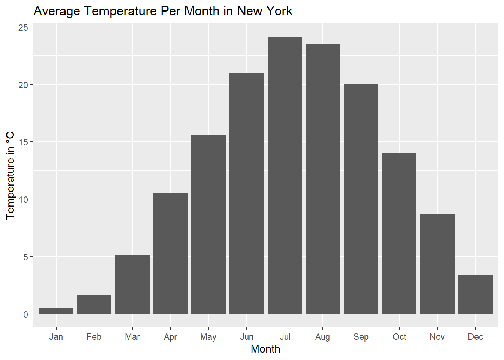

``` r
# This shows what can be assumed, The summer months are hotter on average than the winter months

nyweather_monthly %>% 
ggplot(aes(x = Name_Month, y= monthly_wind_spd_avg))+
  geom_bar(stat = "identity") +
  labs(title = "Average Wind Speed Per Month in New York",
       x = "Month",
       y= "Wind Speed in Mph")
```

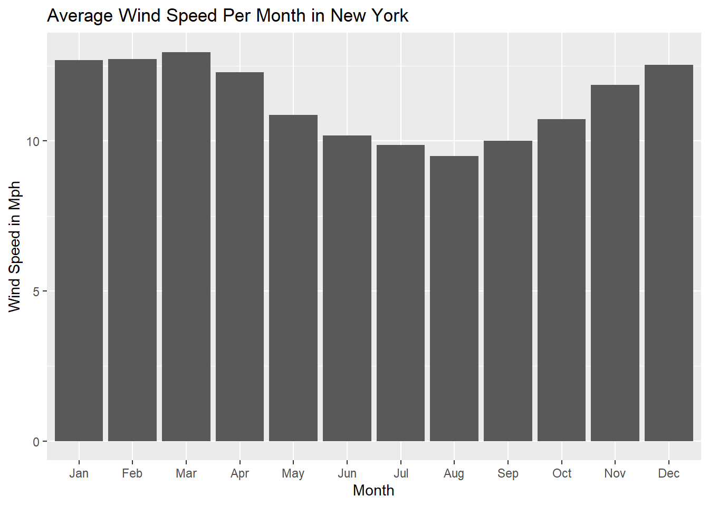

``` r
#This shows that October to April is the windier period of the year, with the summer months having a smaller windspeed. I don't actually know if it's in Miles per Hour but id guess so

nyweather_monthly %>% 
ggplot(aes(x = Name_Month, y= monthly_dewp_avg))+
  geom_bar(stat = "identity") +
  labs(title = "Average Dew Point Per Month in New York",
       x = "Month",
       y= "Dew Point in °C")
```

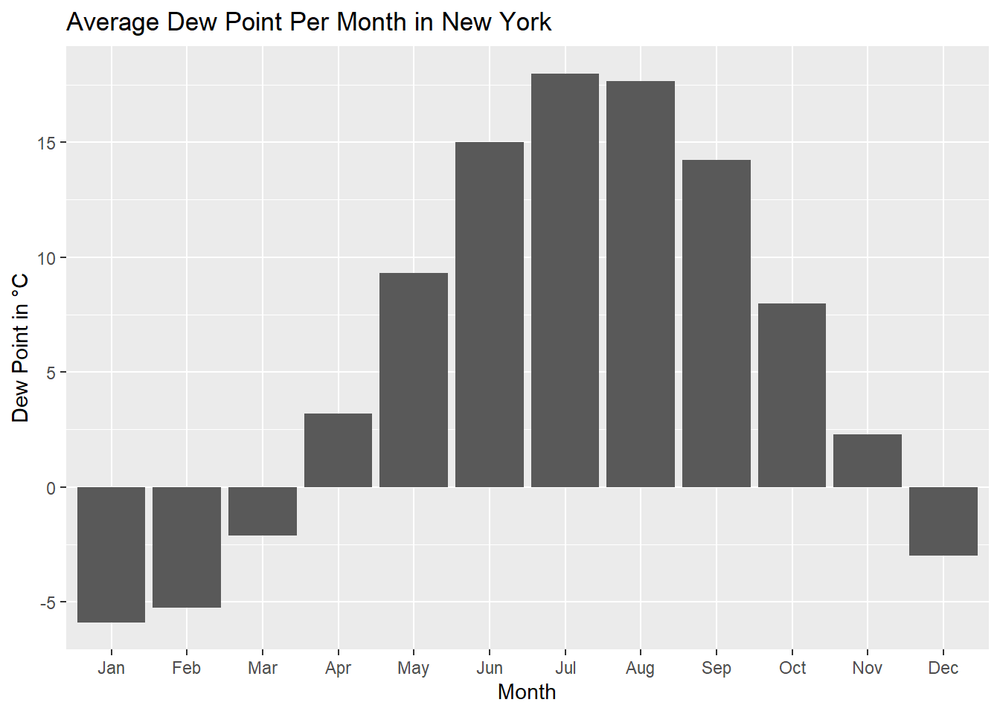

``` r
#The dew point follows a similar curve to that of temperature, suggesting a relationship between the two, from research the higher the dew point the more humid it feels, long periods of a high dew point implies prolonged humidity.

nyweather_monthly %>% 
ggplot(aes(x = Name_Month, y= monthly_wind_chill_avg))+
  geom_bar(stat = "identity") +
  labs(title = "Average Wind Chill Per Month in New York",
       x = "Month",
       y= "Wind Chill in °C")
```

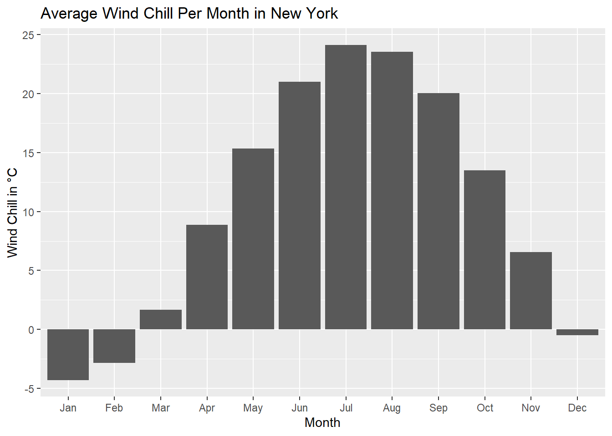

``` r
#This also follows a similar curve as temperature, the wind chill is simply the temperature that the wind makes it, so for example in summer the wind chill is not going to be very active so the temperature is very close to the same as the initial recording but in the colder months the wind chill can make the temperature feel 10 degrees colder.

#These last two will be particularly clear when compared directly with the temperature graph as a decent amount of analysis can be derived from the comparison. Such as a large gap between the temperature and the wind chill temperature implies periods of very cold winds.
```


``` r
#Finding mean and median temperature in the year 
nyweather %>%
  summarise(
    mean_temp_year = mean(temp_avg),
    median_temp_year = median(temp_avg)
  )
```

```
## # A tibble: 1 × 2
##   mean_temp_year median_temp_year
##            <dbl>            <dbl>
## 1           12.4             12.2
```


``` r
ggplot(data=nyweather,
       mapping=aes(
         x= temp_avg))+
  geom_histogram(
    binwidth = 0.7
  )
```

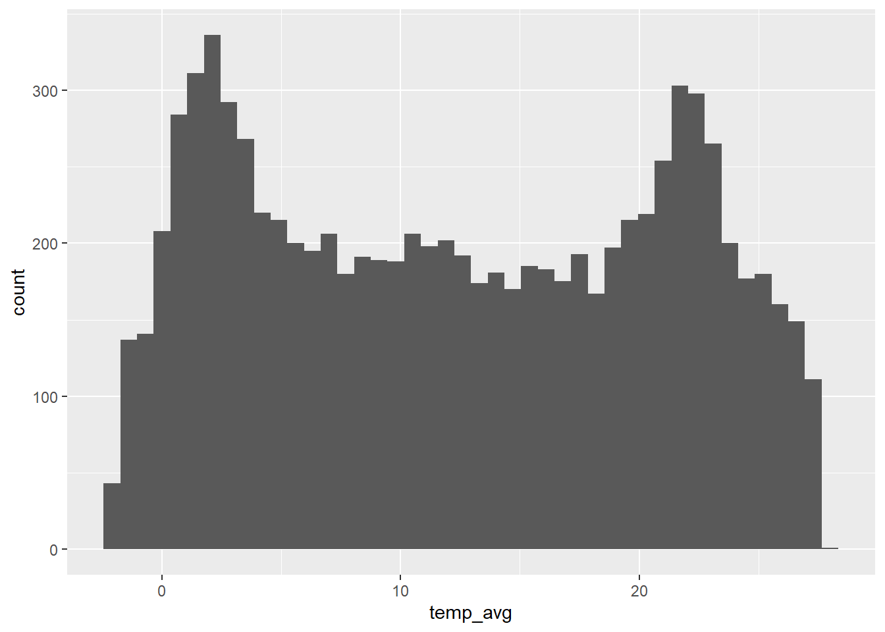

``` r
#count of how may time each temperature is, shows what temperature is most common, which is around 2c and ~22c with temperature in between being similar counts

ggplot(data=nyweather,
       mapping=aes( x=wind_spd_avg))+
  geom_histogram(
    binwidth = 0.2
  )
```

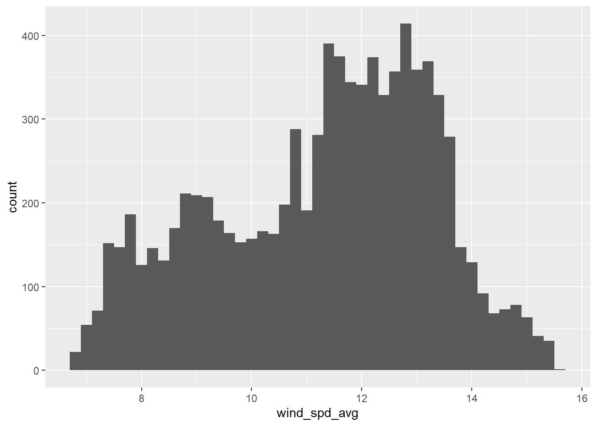

``` r
#shows the average wind speed, which is around 11-13, don't know units xx

ggplot(data=nyweather,
       mapping=aes(x=heat_index_avg))+
  geom_histogram(
    binwidth = 1
  )
```

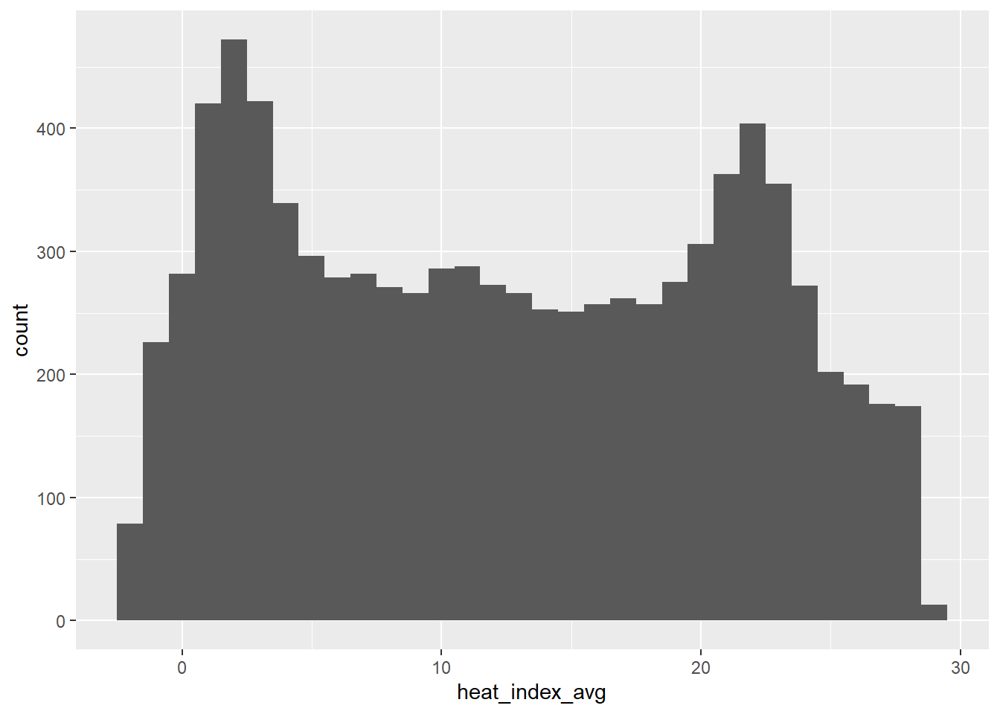

``` r
#shows what the temperature feels like which is similar to the temperature average cause that whats causes it xx

ggplot(data=nyweather,
       mapping=aes(x=wind_chill_avg))+
  geom_histogram(
    binwidth=1
  )
```

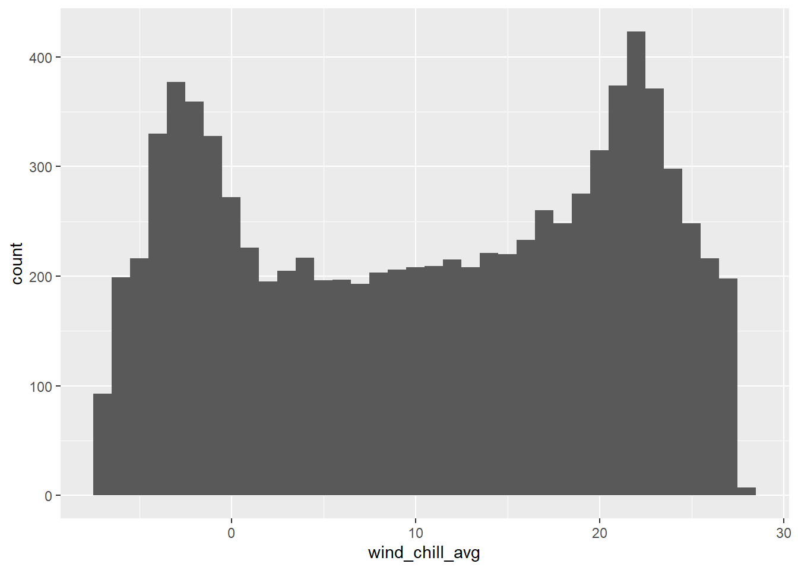

``` r
#Wind chill average is a similar shape to temperature histogram but values are smaller as the wind is colder than the temperature 

ggplot(data=nyweather,
       mapping=aes(x=wind_main_dir))+
  geom_histogram(
    binwidth=1
  )
```

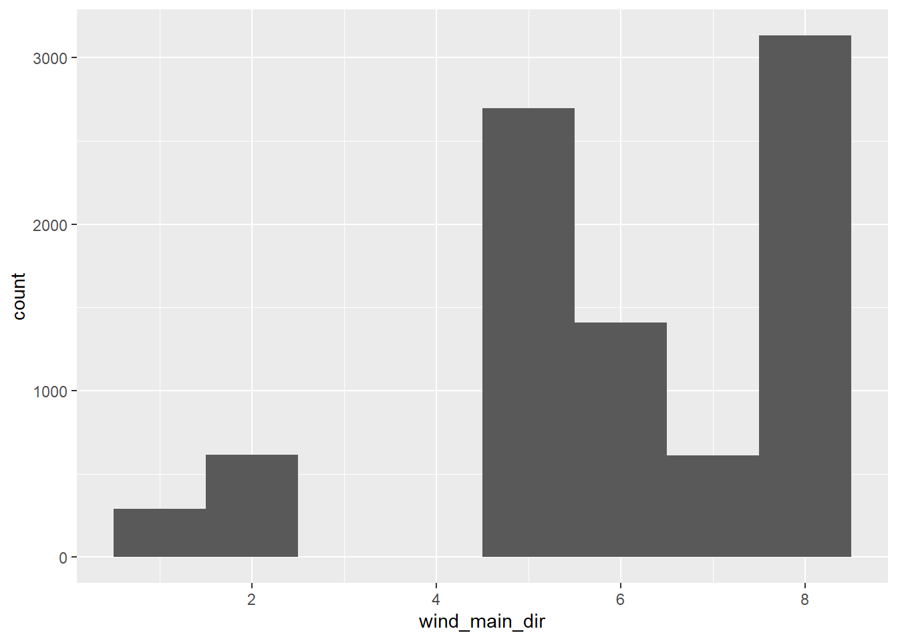

``` r
#Pointing mostly to the west so colder x

ggplot(data=nyweather,
       mapping=aes(x=wind_main_pct))+
  geom_histogram(
    binwidth=3
  )
```

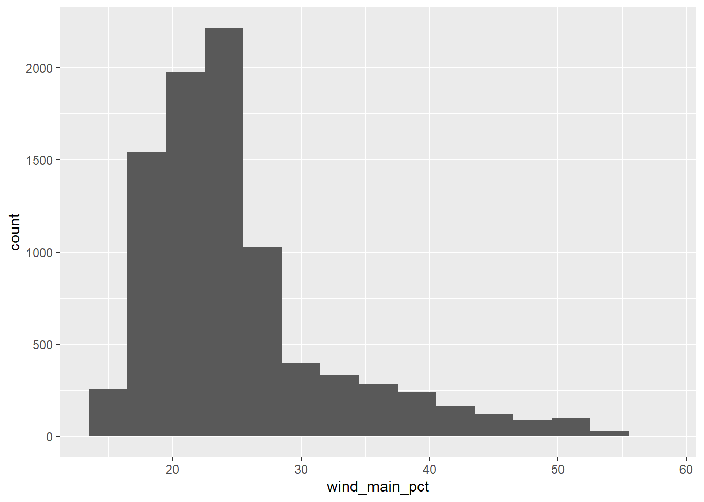

``` r
#Averages around 20%

ggplot(data=nyweather,
       mapping=aes(x=wind_vector_dir))+
  geom_histogram(
    binwidth=5
  )
```

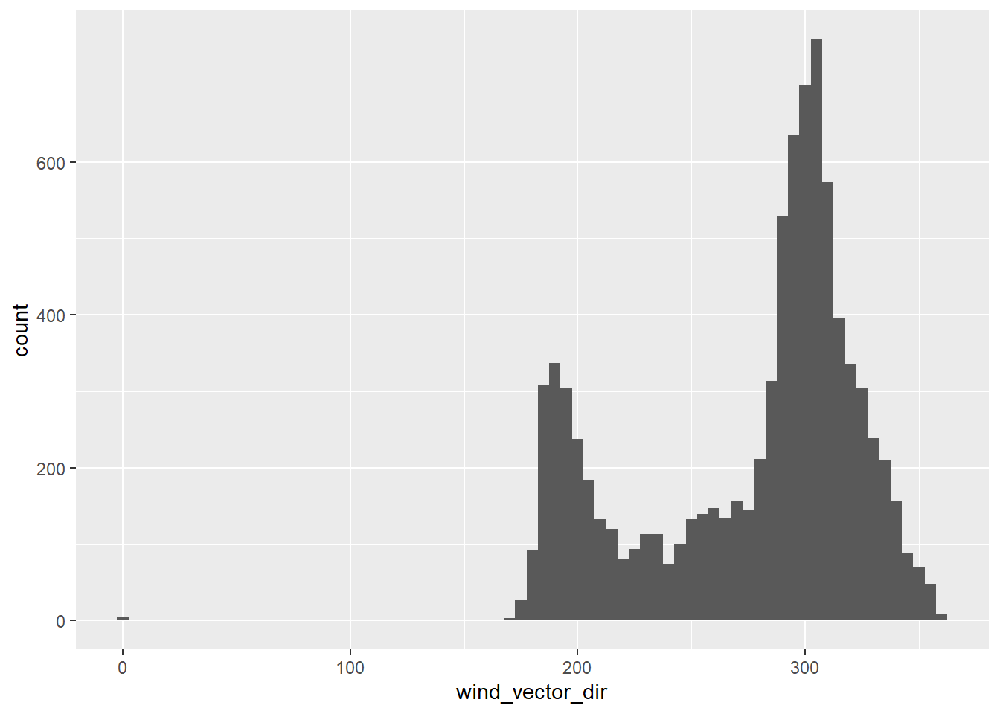

``` r
#Vector averages 300 degrees which means the wind is mostly westerly and that explain wind chill as the wind is coming from over the Atlantic which is colder than land

ggplot(data=nyweather,
       mapping=aes(x=wind_vector_spd))+
  geom_histogram(
    binwidth=0.1
  )
```

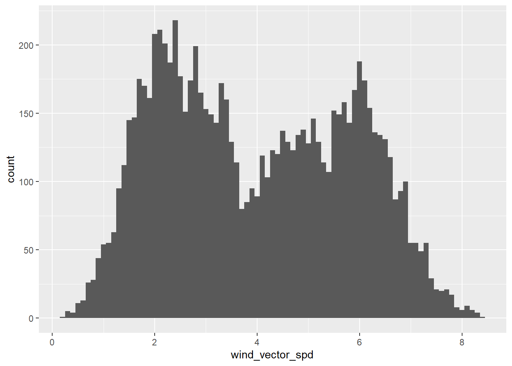

``` r
#I actually have no clue whatb this means
```


``` r
ggplot(nyweather, aes(x = cloud_scat_pct, y = dewp_avg)) + geom_point() + labs(title = "Dew Point Mean plotted against percentage of scattered clouds")
```

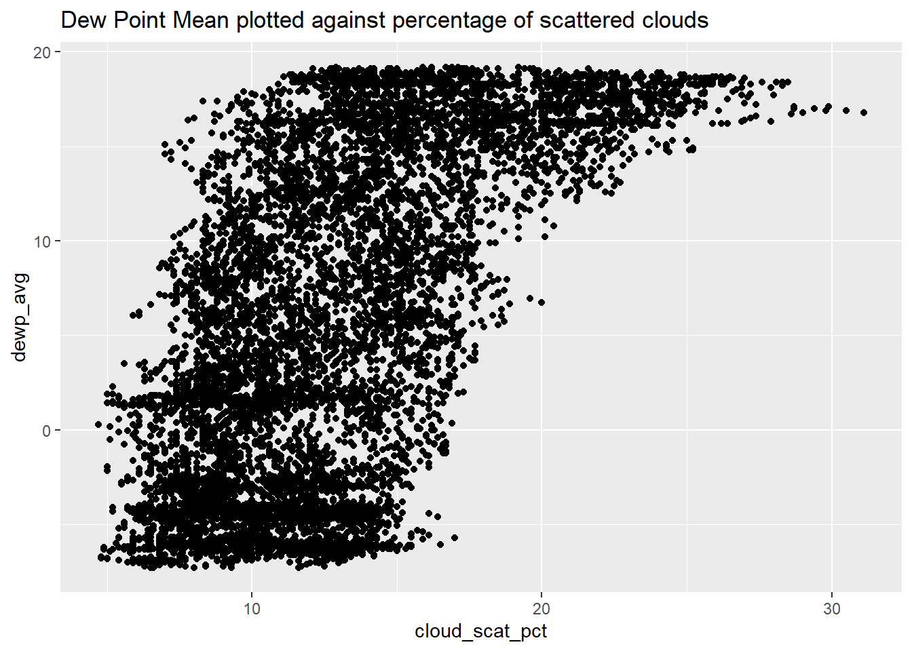

``` r
#Mapping dew point average against the clouds scattered percentage, this graph shows there is little correlation until cloud scattered percentage reaches around 150, from which point it becomes clear that dew point average cannot be under a certain value for any given cloud scattered percentage value 

ggplot(nyweather, aes(x = heat_index_avg, y = dewp_avg)) + geom_point() + labs(title = "Dew Point Mean plotted against heat index mean")
```

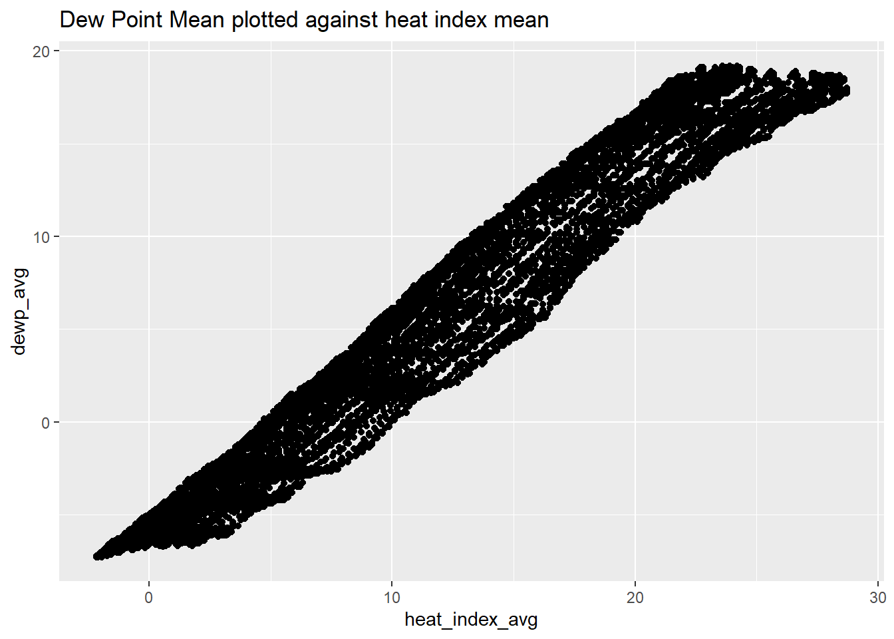

``` r
#Mapping dew point average against the heat index mean, the graph shows a clear linear correlation of dew point average against heat index average 

ggplot(nyweather, aes(x = wind_chill_avg, y = heat_index_avg)) + geom_point() + labs(title = "Heat index mean plotted against wind chill average")
```

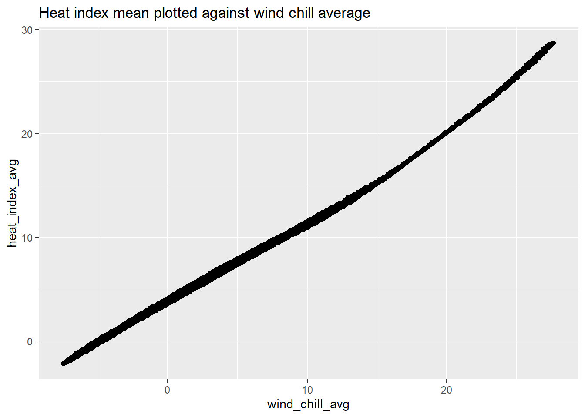

``` r
#Mapping heat index mean against wind chill avg weird ?

ggplot(nyweather, aes(x = wind_spd_avg, y = dewp_avg)) + geom_point() + labs(title = "dew point average plotted against wind speed average")
```

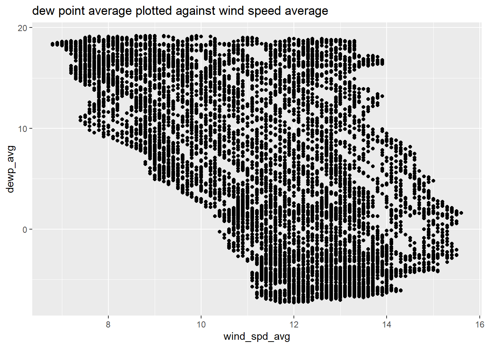


``` r
# Investigating how the average temperature effects the wind direction, more specifically the probability of it being in the west direction (including north west and south west).
nyweather <- nyweather %>%
  mutate(
    wind_main_west = case_when(
      wind_main_dir == "6" ~ "yes",
      wind_main_dir == "7" ~ "yes",
      wind_main_dir == "8" ~ "yes",
      TRUE ~ "no"
    ),
    wind_main_west = fct_relevel(wind_main_west, "no", "yes")
  ) # Creating a column for whether the wind is in the west direction or not.
```


``` r
set.seed(1234)
nyweather_split <- initial_split(nyweather)
nyweather_train <- training(nyweather_split)
nyweather_test  <- testing(nyweather_split) # Splitting data into training and testing.

wind_dir_rec_1 <- recipe(
  wind_main_west ~ temp_avg,
  data = nyweather_train  # Created a recipe.
)

wind_dir_mod_1 <- logistic_reg() %>%
  set_engine("glm")     # Created a model.

wind_dir_wflow_1 <- workflow() %>%
  add_model(wind_dir_mod_1) %>%
  add_recipe(wind_dir_rec_1) #Added them to a work flow.
```


``` r
wind_dir_fit_1 <- wind_dir_wflow_1 %>%
  fit(data = nyweather_train)  # Applying work flow to training data.

tidy(wind_dir_fit_1)  # You can see from the table below, that as the average temperature increases the smaller the logic of the probability, and therefore the smaller the probability that the wind will be in the west direction. Or in other words if it is colder it is more likely the wind will be going in the west direction (Including north west and south west direction).
```

```
## # A tibble: 2 × 5
##   term        estimate std.error statistic p.value
##   <chr>          <dbl>     <dbl>     <dbl>   <dbl>
## 1 (Intercept)    2.63    0.0674       39.0       0
## 2 temp_avg      -0.170   0.00424     -40.1       0
```

``` r
# The formula of the line is log(p/1-p) = 2.63 - 0.17 temp_avg, where p is the probability that the wind is in the west direction.
```

``` r
wind_dir_pred_1 <- predict(wind_dir_fit_1, nyweather_test, type = "prob") %>% 
  bind_cols(nyweather_test) 
wind_dir_pred_1 # Using fitted model to predict the testing data.
```

```
## # A tibble: 2,190 × 31
##    .pred_no .pred_yes day   time     cool_deg_hrs cloud_brkn_pct cloud_clr_pct
##       <dbl>     <dbl> <chr> <chr>           <dbl>          <dbl>         <dbl>
##  1   0.0723     0.928 01-01 04:00:00            0           14.3          23.4
##  2   0.0705     0.930 01-01 06:00:00            0           12.7          18.4
##  3   0.0705     0.930 01-01 07:00:00            0           22.8           9.9
##  4   0.110      0.890 01-01 12:00:00           NA           22.9          11.6
##  5   0.117      0.883 01-01 13:00:00           NA           25.1          11.1
##  6   0.0970     0.903 01-01 19:00:00            0           17.2          17  
##  7   0.0854     0.915 01-01 22:00:00            0           17.5          21.8
##  8   0.0762     0.924 01-02 01:00:00            0           12.4          23.1
##  9   0.116      0.884 01-02 13:00:00           NA           25.9          11.5
## 10   0.0876     0.912 01-02 21:00:00            0           17.3          18.9
## # ℹ 2,180 more rows
## # ℹ 24 more variables: cloud_few_pct <dbl>, cloud_ovrcst_pct <dbl>,
## #   cloud_scat_pct <dbl>, dewp_10 <dbl>, dewp_90 <dbl>, dewp_avg <dbl>,
## #   heat_index_avg <dbl>, heat_deg_hrs <dbl>, pres_10pctl <dbl>,
## #   pres_90pctl <dbl>, pres_avg <dbl>, temp_10pctl <dbl>, temp_90pctl <dbl>,
## #   temp_avg <dbl>, wind_chill_avg <dbl>, wind_main_dir <dbl>,
## #   wind_main_pct <dbl>, wind_2nd_dir <dbl>, wind_2nd_pct <dbl>, …
```

``` r
wind_dir_pred_1 %>%
  roc_curve(
    truth = wind_main_west,
    .pred_yes,             
    event_level = "second"
  ) %>%
  autoplot() # Plotting a ROC curve
```

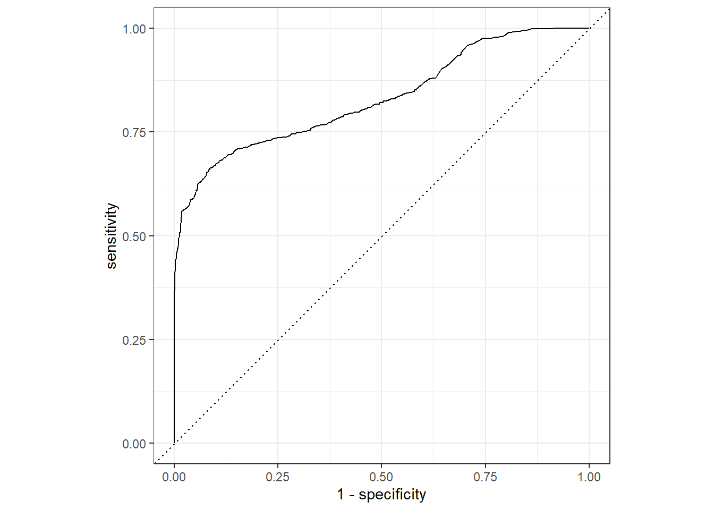

``` r
wind_dir_pred_1 %>%
  roc_auc(
    truth = wind_main_west,
    .pred_yes,             
    event_level = "second"
  ) # As seen below the ROC area is relatively close to one which is the ideal value. This means the model has fit the testing data quite well.
```

```
## # A tibble: 1 × 3
##   .metric .estimator .estimate
##   <chr>   <chr>          <dbl>
## 1 roc_auc binary         0.831
```


``` r
# linear regression of wind chill against heat index
set.seed(1234)
nyweather_split2 <- initial_split(nyweather)
nyweather_train2 <- training(nyweather_split2)
nyweather_test2  <- testing(nyweather_split2)

wind_heat_mod <- linear_reg() %>%
  set_engine("lm")

wind_heat_rec <- recipe(
  wind_chill_avg ~ heat_index_avg,
  data = nyweather_train2
)

wind_heat_wflow <- workflow() %>%
  add_model(wind_heat_mod) %>%
  add_recipe(wind_heat_rec)

wind_heat_fit <- wind_heat_wflow %>%
  fit(data = nyweather_train2)

wind_heat_pred <- predict(wind_heat_fit, nyweather_test2) %>%
  bind_cols(nyweather_test2 %>% select(wind_chill_avg, heat_index_avg))

rsq(wind_heat_pred, truth = wind_chill_avg, estimate = .pred)
```

```
## # A tibble: 1 × 3
##   .metric .estimator .estimate
##   <chr>   <chr>          <dbl>
## 1 rsq     standard       0.994
```

``` r
rmse(wind_heat_pred, truth = wind_chill_avg, estimate = .pred)
```

```
## # A tibble: 1 × 3
##   .metric .estimator .estimate
##   <chr>   <chr>          <dbl>
## 1 rmse    standard       0.793
```
